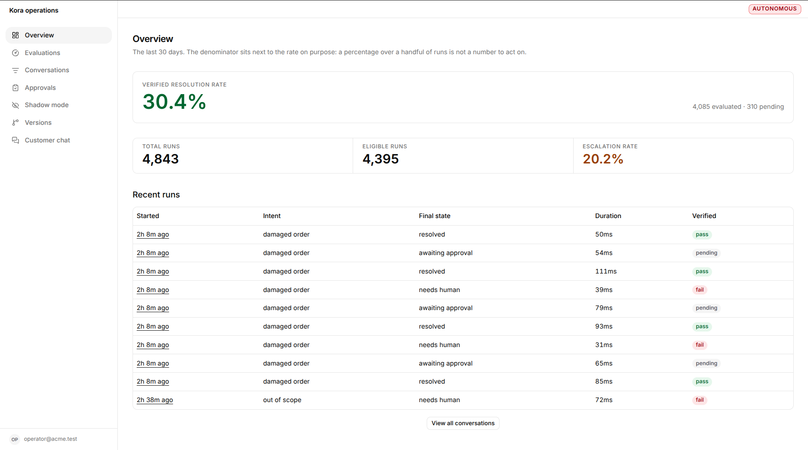

# Kora

Kora is a customer support agent. A customer describes a problem, Kora looks up
their order, checks the rules, does the thing if the rules allow it, and then
reads the order back to make sure it really happened before telling the customer.

That last part is the point. It does not say a replacement was created because it
sent the request. It says so because it looked.

---

## The operator side

Every run is recorded and scored, so you can see what the agent did and whether it
worked.



---

## Running it

You need Node 24 or newer, pnpm, and Docker. You do not need an API key. Kora
ships with an offline model, so everything works with no account anywhere.

```bash
cp .env.example .env
pnpm install
pnpm infra:reset                            # database and cache, ready to use

pnpm --filter @kora/mock-commerce start &   # the pretend shop, on :4001
pnpm --filter @kora/worker start &          # background jobs
pnpm --filter web dev &                     # Kora, on :3000

pnpm kora scenarios                         # should print 12 of 12 passed
```

Then open http://localhost:3000/chat and say:

> My coffee machine from order 9832 arrived broken. I want a replacement.

To see the operator side, sign in at http://localhost:3000/login with
`operator@acme.test` and `operator-password`.

---

## What is in here

```
apps/web                  the chat and the operator screens
packages/core             types, money, ids, the rules engine
packages/db               database tables and queries
packages/tools            the nine things the agent can do
packages/ai               the agent itself
packages/evaluation       scoring the agent and re-running old conversations
services/mock-commerce    a pretend shop to act against
services/worker           background jobs
config                    the agent, the rules, the knowledge it reads
docs                      everything else
```

---

## Common commands

```bash
pnpm test           # all the tests
pnpm lint           # formatting plus a few structural checks
pnpm kora bench     # 120 test conversations, scored
pnpm kora replay    # run old conversations again against a new version
pnpm kora chaos     # break things on purpose and check nothing goes wrong
```

`pnpm kora` on its own lists the rest.

---

## When money calls fail

Kora fails closed: a dead dependency means escalation, never a guessed answer
or a duplicate write. What each failure looks like and what to do:

| Symptom | Likely cause | First action |
|---|---|---|
| "Kora cannot reach Stripe with this key" | revoked, wrong, or under-scoped tenant key | check the key and its permissions, re-set it, retry |
| Refunds timing out, breaker flapping | Stripe rate limit (429) | stop retrying by hand, let the backoff work, lower traffic or raise quota |
| Refund approved but never confirmed | webhook down or refund stuck `pending` | check the webhook endpoint and signature secret, re-fetch the refund in Stripe |

Full steps for each are in `docs/runbook.md` (Stripe sections). The Stripe
integration itself is still being built — `docs/00-overview/status.md` says
exactly what is proven and what is not.

---

## Where to read more

Everything else is in `docs/`.

| You want to | Read |
|---|---|
| Set it up properly | `docs/QUICKSTART.md` |
| Understand how it fits together | `docs/00-overview/README.md` |
| Know what works and what does not | `docs/00-overview/status.md` |
| Know why something was built that way | `docs/decisions.md` |
| Fix it when it breaks | `docs/runbook.md` |
| Put it on a server | `docs/10-deployment/README.md` |
