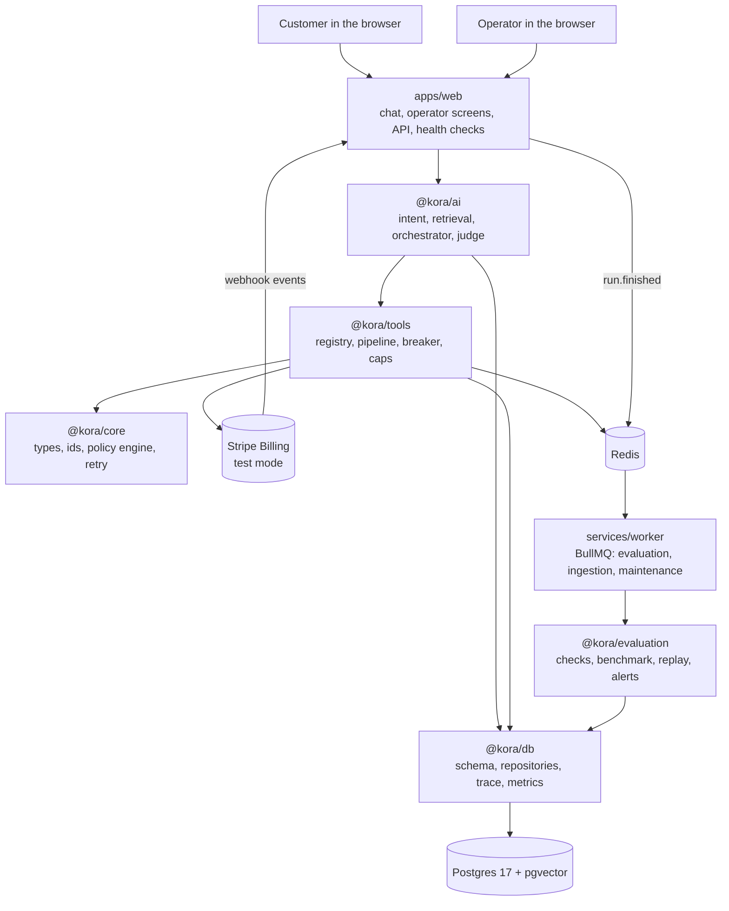
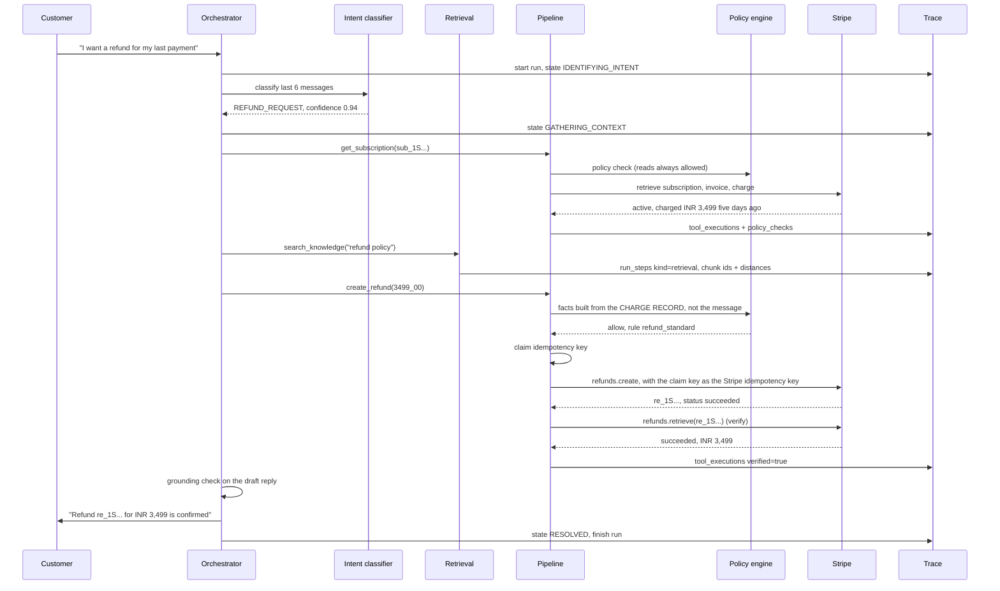
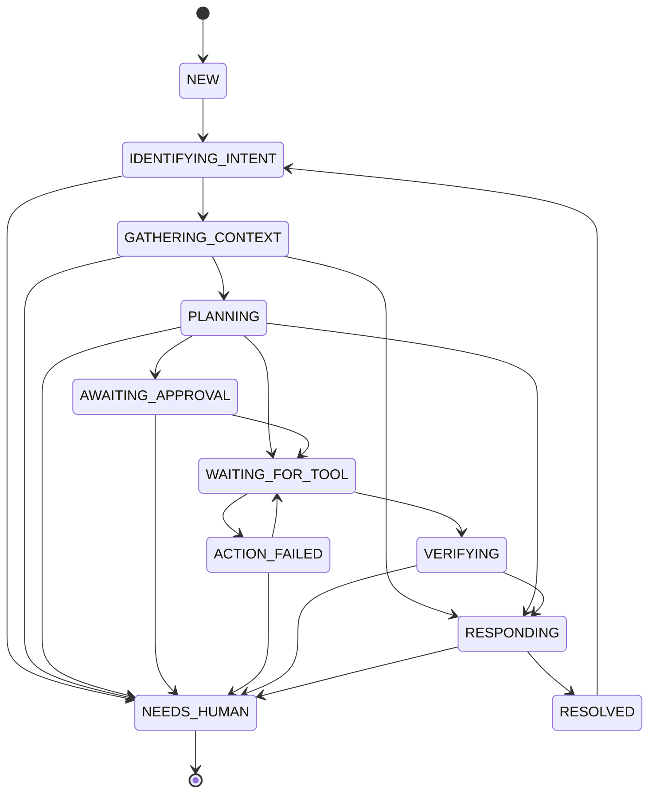

# Architecture

Kora answers a customer, performs a money operation on Stripe, and then proves
the operation actually happened. The proving is the point. Everything below
exists to make a claim to a customer checkable against Stripe afterwards.

## The shape of the system



Stripe is reached from exactly one package. `@kora/evaluation` reads traces from
the database rather than Stripe, so scoring a run never depends on the money
system still being up.

The request path never evaluates. A finished run writes a `run.finished` row to
`events` and then enqueues it; the worker picks it up. The row is written first
on purpose, so a lost job can be replayed from the table and a lost row cannot be
replayed from anywhere. If Redis is unreachable the chat route falls back to
evaluating in an `after()` hook, which is what keeps a single-process deployment
working with no worker at all.


## Package boundaries

```
core  <-  db  <-  tools  <-  ai
                     ^
                     |
              evaluation
```

- `core` imports nothing from the workspace. Types, ids, money, clock, canonical
  JSON, errors, the policy engine, the retry table and secret encryption.
- `db` imports `core`. Schema, tenant-scoped repositories, trace writer, trace
  assembler, metric queries.
- `tools` imports `core` and `db`. The Stripe provider, the eleven tools,
  idempotency, the circuit breaker, limited-mode caps, and the execution
  pipeline.
- `ai` imports `core`, `db`, `tools`. Model gateway, knowledge, intent, the
  orchestrator, the judge caller.
- `evaluation` imports `core`, `db`, `tools`. It reads traces after the fact:
  checks, the failure taxonomy, the benchmark, replay, chaos and the alert rules.
- `services/worker` imports all of them. It is the only place BullMQ appears, so
  a queue never becomes a hidden dependency of the request path.
- **`ai` must never import `evaluation`.** The evaluator is not a runtime
  dependency. If it becomes one, replaying a past run becomes impossible.

`scripts/check-deps.ts` fails the build on any edge outside that matrix, and names
the `ai -> evaluation` case explicitly because it is the one that quietly breaks
later work.

The policy engine lives in `core` because `compilePolicy` and `evaluatePolicy` are
pure: no I/O, no clock, no `await`. Both `tools` (to gate an action) and
`evaluation` (to check compliance afterwards) need them, and putting them in
`core` avoids a cycle. Loading a YAML file from disk is a separate concern and
lives with the caller.

## One customer turn, end to end



A refund Stripe returns as `pending` takes a different path: verify fails, the
run escalates, and the customer is told a person will confirm. The
[webhook](../08-integrations/README.md#the-webhook) reconciles it when the refund
settles.

## The five things that make this different from a chatbot

**1. Business rules live in code, not in a prompt.** `packages/core/src/policy/`
compiles a YAML file into a predicate tree and evaluates it as a pure function.
The model can be argued with. The engine cannot.

**2. Policy facts come from records, never from the customer's text.**
`packages/tools/src/facts.ts` derives `daysSinceCharge` from `charge.created`,
`remainingRefundableMinor` from captured minus already-refunded, and so on. If
the message says the payment was yesterday and Stripe says forty-five days ago,
Stripe wins, silently. This is the half of prompt-injection defence that actually
works. The prompt wording is the other half, and the weaker one.

**3. Every write goes through one chokepoint.**
`packages/tools/src/pipeline.ts` runs thirteen stages in a fixed order: version,
input, permission, policy, caps, approval, deployment mode, breaker,
idempotency, execute, output, verify, settle. A money write also passes a
tenant-key gate between the mode gate and the breaker, so a tenant with no key
fails closed before an idempotency claim is burned. A policy check after
execution is not a policy check. `scripts/check-billing-imports.ts` fails the
build if anything outside `packages/tools/src/` imports the Stripe SDK or the
provider. See
[the pipeline](../06-backend/tool-pipeline.md) and
[the deployment ladder](../06-backend/deployment-ladder.md).

**4. A 200 is not proof.** After a successful write the pipeline reads the object
back out of Stripe. A refund passes only if its status is `succeeded` and the
amount and currency match the request to the minor unit; `pending` and
`requires_action` are not success. If the read-back disagrees, the run records
`verified: false`, escalates with `VERIFICATION_FAILED`, and the customer is told
a person will confirm. It never guesses which way the write went.

**5. The reply is checked against the tool results.**
`packages/ai/src/grounding.ts` pulls every refund id, subscription id, invoice id,
plan name and money amount out of the draft and asserts each appears in a tool
result from this run. Money must match to the minor unit. Anything unsupported
replaces the whole message with a safe fallback and escalates.

## Agent states



The table is data, in `packages/ai/src/state.ts`. An undeclared transition throws
rather than logging and carrying on: reaching an impossible state is a bug in the
orchestrator, and a run that hits one should fail loudly.

## Where a run is recorded

Every turn writes as it goes, not at the end. If the customer closes the tab, the
run still completes and the trace is still whole. `assembleTrace(tenantId, runId)`
rebuilds the entire run from nine small indexed queries, with no log files
involved. See [the database docs](../03-database/README.md).

## Beyond a single workflow

Five capabilities sit on top of the loop above, each with its own page.

**A deployment ladder.** `simulation → shadow → human_approval → limited → full`,
one setting per tenant and overridable per run. The mode gate sits inside the
pipeline after the approval branch, so a write that policy sends to a person
still stops for one even in simulation. See
[the ladder](../06-backend/deployment-ladder.md).

**Replay.** Historical conversations re-run against a different agent version,
served from the Stripe responses recorded that day rather than from Stripe as it
is now. Self-replay
must produce an empty diff, and the command exits non-zero if it does not. See
[replay](../09-testing/replay.md).

**Versioning that survives a promotion.** Agent and policy versions are rows with
partial unique indexes and PL/pgSQL triggers that reject a write to an active
version. A run pins its version at start, so an in-flight conversation finishes
on the version it began with.

**Isolation in the database, not just in the query.** The application connects as
a non-superuser with a row-level security policy on every tenant-owned table. Nine
tests query with no `WHERE tenant_id` at all and still see only their tenant.
Application scoping is one forgotten clause from a leak; this is the layer that
makes that clause not the last line of defence.

**Reliability and alerting.** Per `(tenant, tool)` circuit breakers, a single
retry table keyed by retry class, a model fallback that never applies to the
judge, and eight alert rules that each carry a drill path to a route that exists.
See [reliability](../06-backend/reliability.md) and
[alerting](../06-backend/alerting.md).
