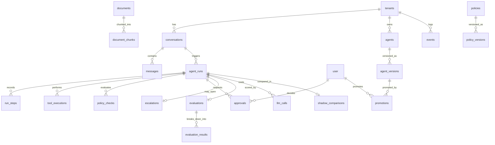

# Database

One Postgres 17 database with pgvector, running in Docker. It holds Kora's own
records: conversations, runs, traces, policy checks, evaluations, approvals and
the encrypted per-tenant settings. It does **not** hold a copy of the money.
Subscriptions, invoices, charges and refunds live in Stripe, and Kora reads them
when it needs them.

## How application code reaches the database

Never directly. Everything goes through a tenant-scoped repository:

```ts
const repos = withTenant('ten_acme');
await repos.conversations.create({ externalCustomerId: 'cus_014' });
```

No repository method takes a `tenantId` argument. It is closed over by
`withTenant()`. That is what makes forgetting it impossible: there is no signature
you can call that leaves the tenant out.

`db()` and `sql()` are exported for migrations, tests and the few aggregate
queries that repositories do not cover. Route handlers and agent code use
repositories.

## Two layers of tenant isolation

The repository closure is layer one. Layer two is the database.

Every tenant-owned table has `ENABLE ROW LEVEL SECURITY` and `FORCE ROW LEVEL
SECURITY`, with a policy comparing `tenant_id` against
`current_setting('kora.tenant_id', true)`. The application connects as
`kora_app`, a role that owns nothing and is **not a superuser**, because a
superuser bypasses row-level security entirely and makes the whole layer inert.

```ts
postgres(env.DATABASE_APP_URL ?? env.DATABASE_URL, {
  connection: { 'kora.tenant_id': env.KORA_TENANT_ID },
});
```

The tenant is a **connection parameter**, not a per-query `set_config`. A pooled
connection that forgot to reset would otherwise serve the previous tenant's rows.
For a transaction that needs a different tenant, `withTenantTx` sets it locally so
it unwinds with the transaction.

Twenty-five tables are covered, including `tenant_settings` (which holds the
encrypted Stripe key) and `stripe_webhook_events`. The auth tables are
deliberately not: a user and a session are not tenant-owned, and scoping them
would break sign-in.

`packages/db/test/isolation.test.ts` proves it with queries that have **no
`WHERE tenant_id` at all**:

```
as ten_acme: 2009 rows
as ten_someone_else: 0 rows
with no tenant set: 0 rows
```

It also asserts `kora_app` is not a superuser, because that one property is what
makes every other assertion in the file meaningful.

Writing a row for another tenant, or moving one, raises a row-level security
error. Reading another tenant's row by its exact id returns nothing — not a
permission error, which is also why the API answers 404 rather than 403.

**Migrations run as the owner.** `runMigrations()` opens its own connection on
`DATABASE_URL` rather than borrowing `db()`, because the application role cannot
run DDL. That is the point of the role, and it is why `pnpm migrate:job` needs no
special environment.

## Tables



Every table carries `tenant_id` with an index on it, except the four Better Auth
tables (`user`, `session`, `account`, `verification`), which are global.

### The run trail

A single customer turn produces one `agent_runs` row and a trail underneath it:

| Table | Holds |
|---|---|
| `run_steps` | every step in order: intent, retrieval, model, tool, policy, approval, verify, response, state |
| `tool_executions` | one row per tool attempt, with input, output, status, error code, and the verification read-back |
| `policy_checks` | one row per policy evaluation, including the ones that returned `allow` |
| `approvals` | pending and decided human approvals, with the real user id that decided |
| `escalations` | the handoff payload, built at escalation time |
| `llm_calls` | one row per model call, including failed attempts, with tokens, latency and cost |
| `evaluations` + `evaluation_results` | the nine deterministic checks, the judge verdicts and the verified-resolution bit |
| `events` | the log. A row is written **before** the job is enqueued, so a lost job can be replayed from here and a lost row cannot be replayed from anywhere |

`agent_runs.deployment_mode` records which rung of the ladder produced the run.
Without it a shadow run and a production run are indistinguishable afterwards.

Retrieval does not get its own table. It is a `run_steps` row with `kind =
'retrieval'` whose payload carries the query, filters, chunk ids and distances.
One fewer table to keep consistent, and the trace assembler pulls it out by kind.

### Knowledge

`documents` carries `status`, `version`, `effective_from` and `effective_to`.
`document_chunks` carries `embedding vector(1536)` with an HNSW index using
`vector_cosine_ops`. Retrieval filters on document status and effective dates in
SQL *before* the vector search, then orders by `cosineDistance` ascending so the
HNSW index is actually used.

### Idempotency

`idempotency_keys` is the lock for every write tool. The claim is a single
`INSERT ... ON CONFLICT (key) DO NOTHING RETURNING key`. A row coming back means
you own the claim. No Redis, no read-then-write, no distributed lock.

## Migrations

Drizzle owns `packages/db/migrations/`. Generate with `drizzle-kit generate`,
apply with `pnpm --filter @kora/db exec tsx src/migrate.ts`.

`packages/db/extensions.sql` sits outside that folder and runs first, because
drizzle does not create extensions and every vector column depends on one.
It is not in drizzle's journal on purpose: `runMigrations()` applies it by hand
before handing over to the drizzle migrator.

Migrations never run on application boot. Two instances racing on the same
migration is a deadlock waiting to happen. `pnpm migrate:job` runs them as a
separate step under a Postgres advisory lock, so two simultaneous deploys
serialise instead.

Some migrations are hand-written rather than generated, and a hand-written file
needs its own entry in `meta/_journal.json` or the migrator will not see it. The
ones that are hand-written are the ones drizzle-kit cannot express:

| Migration | Why by hand |
|---|---|
| `0010_version_immutable` | partial unique indexes plus PL/pgSQL triggers that reject a write to an active version |
| `0012_enable_rls` | `ENABLE` and `FORCE ROW LEVEL SECURITY` and a policy on 22 tables |
| `0013_app_role` | creates the non-superuser `kora_app` role, grants, and default privileges |

Migrations must be safe to run **while the previous release is still serving**;
during a rollout both versions are live. A column is added over two releases, not
one. `docs/10-deployment/README.md` has the table.

## Seed

`packages/db/src/seed.ts` inserts exactly one tenant (`ten_acme`) and one operator
user. It is idempotent: it checks for the operator by email and returns early if
one exists. The password hash is written directly in Better Auth's scrypt
`<salt>:<key>` format so seeding does not have to boot the auth server.

`pnpm kora seed` then runs the Stripe fixtures for that tenant. Those are
currently in-memory (`StubFixtureBackend`) and write a manifest to
`tenant_settings.stripe_fixtures`; nothing is created in a Stripe account. See
[Status](../00-overview/status.md#what-is-not-proven).

The tenant's Stripe key is not seeded. Set it with `pnpm kora stripe:set-key`.
