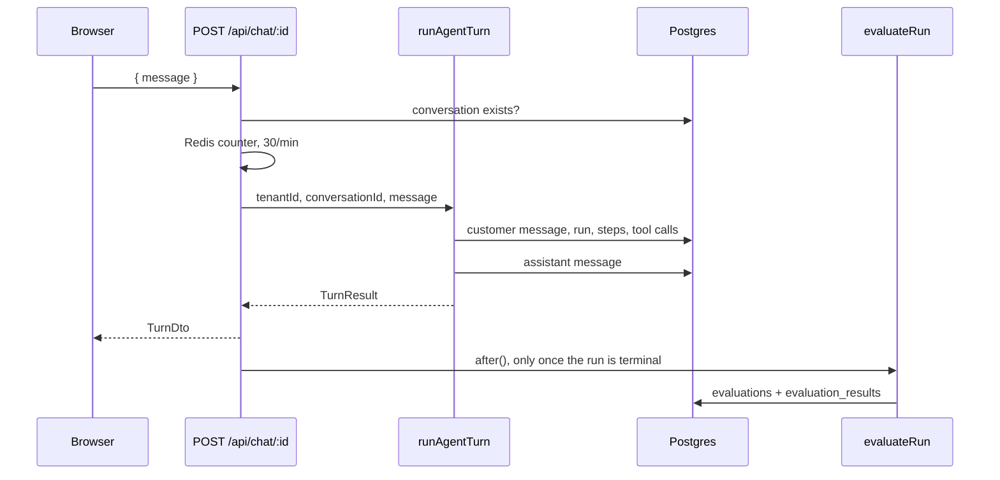

# HTTP API

Every route lives under `apps/web/app/api`. Request and response shapes are zod
schemas and explicit DTOs in `apps/web/lib/api/schemas.ts`. No route returns a raw
Drizzle row.

## Routes

| Route | Session | What it does |
|---|---|---|
| `POST /api/conversations` | no | Creates a conversation, returns `{ conversationId }` |
| `POST /api/chat/:conversationId` | no | Runs one agent turn, returns a `TurnDto` |
| `GET /api/conversations/:id` | operator | Conversation, messages, latest run, pending approval |
| `GET /api/conversations/:id/trace` | operator | Full `TraceDto`, newest run or `?runId=` |
| `GET /api/conversations?cursor=&limit=&…` | operator | Keyset page of run summaries |
| `GET /api/approvals?status=&tool=&minValueMinor=` | operator | The queue, money at risk first |
| `POST /api/approvals/:id/decision` | operator | Approve or deny, and resume or hand off |
| `GET /api/metrics?from=&to=&intent=&agentConfigVersion=` | operator | Live aggregate plus the VRR trend |
| `GET /api/metrics/failures?from=&to=` | operator | `[{ code, count, topDetail }]` |
| `POST /api/agent-versions/rollback` | operator | Reactivates the previous version, no gates |
| `GET /api/status` | operator | Running version, active agent versions, queue depth, breaker state |
| `POST /api/webhooks/stripe` | signature | Reconciles refund and subscription events |
| `GET /healthz` | no | Liveness. Imports nothing and touches no dependency |
| `GET /readyz` | no | Readiness. Probes Postgres, Redis and the model provider, cached 10s |
| `/api/auth/*` | — | Better Auth handler, email and password only |

Customer routes are not behind a session. They are scoped by the conversation id,
which is an unguessable ULID. Operator routes call `requireOperator()` before doing
any work, and a missing session is a 401 rather than an empty result.

The Stripe webhook has no session either. It authenticates by HMAC signature over
the raw request bytes, with a five-minute timestamp tolerance and a constant-time
compare, and it answers 400 rather than 401 when that fails — an unsigned request
is a malformed one, not an unauthenticated user. With no secret configured it
answers 500 and processes nothing; it never falls through to accepting unsigned
events. Each `event.id` is claimed once, so Stripe's redeliveries are no-ops. See
[integrations](../08-integrations/README.md#the-webhook).

`pnpm lint` runs `scripts/isolation-suite.ts`, which walks every `route.ts` under
`app/api` and fails the build unless the handler calls `requireOperator()` or the
route is on an explicit public list with a comment saying why. Health checks are
public on purpose: a load balancer has no session.

Row-level security sits underneath all of this. The application connects as
`kora_app`, a non-superuser with a policy on every tenant-owned table, so a
handler that forgets its tenant filter still returns nothing. See
[the database notes](../03-database/README.md).

## The chat turn



The response is not token-streamed. `runAgentTurn` resolves once the whole turn is
finished and already persisted, so a client that disconnects mid-request still leaves
a complete trace. See `docs/decisions.md`.

Evaluation is scheduled with Next.js `after()` and only when the run reached a
terminal state. A run sitting in `AWAITING_APPROVAL` is not evaluated yet. The call
is a dynamic import wrapped in `.catch(() => {})`: a broken evaluator must never
break a conversation.

## Errors

Every failure is `{ error: { code, message, traceId } }`, including 500s. `traceId`
is minted per response when the failure is not tied to a run.

| Case | Status |
|---|---|
| Body fails its zod schema | 400 |
| Operator route with no session | 401 |
| Unknown conversation, run or approval | 404 |
| Approval already decided | 409 |
| Approval expired | 410 |
| Over the rate limit for the route class | 429 + `Retry-After` |
| The model provider's breaker is open | 503 + `Retry-After` |
| Anything unhandled | 500 |

A 404 does not distinguish "does not exist" from "not yours". Both look identical.

## Rate limiting

A Redis sliding window per route class: 30 a minute per conversation on chat, 300
per operator on the operator routes, 10 per client address on auth. Each is
applied at the one place every route in its class already passes through, so a new
route inherits the limit rather than needing someone to remember it. Details and
the reasoning are in [reliability](../06-backend/reliability.md#rate-limiting).


## The operator read endpoints

All three are backed by `packages/db/src/queries/`. See
`docs/06-backend/query-layer.md` for what the numbers mean and why.

### `GET /api/metrics`

Returns automation, escalation and verified resolution rates, policy compliance,
tool success, grounding, p50 and p95 latency, cost per resolution, coverage, and a
per-day VRR trend for the chart. Rates over zero eligible runs are `null`, never
`0`. `runs.pending` counts runs whose evaluation has not landed yet; they are never
counted as failures.

A range wider than 90 days is a 400, not a slow query.

### `GET /api/conversations`

```
?cursor=&limit=&intent=&outcome=&failureCode=&verified=&escalated=&escalationStatus=&from=&to=
-> { items: ConversationSummaryDto[]; nextCursor: string | null }
```

`limit` defaults to 50 and caps at 200. A cursor this endpoint did not issue is a
400 with a message that says to start from the first page, never a 500.

`POST /api/conversations` still creates a conversation. The two share a file.

### `GET /api/approvals`

`status` is one of `pending`, `decided`, `expired` or `all`, defaulting to
`pending`. `scope=today` narrows decided approvals to today. `tool` filters by tool
name, and `minValueMinor` / `maxValueMinor` give the value bands. Rows come back
sorted by money at risk descending, longest wait breaking ties.

Reading the queue expires anything past its TTL first, so a stale pending row can
never be served.

### `POST /api/approvals/:id/decision`

| Case | Status |
|---|---|
| decided | 200, with the approval and the resumed turn |
| already decided by someone else | 409, message names the decision and the operator |
| past `expires_at` | 410, and the conversation has already been handed to a person |
| unknown id | 404 |

## The pending-approval webhook

`apps/web/lib/notify/webhook.ts`. One POST, no retries, no queue, fired from the
chat route's `after()` hook when a turn leaves an approval pending. A dead endpoint
is logged at warn and dropped: an approval a customer is already waiting on must
never fail because a chat integration is down.

The endpoint comes from `KORA_APPROVAL_WEBHOOK_URL`. Unset means
`approvalWebhookUrl()` returns `null` and nothing is sent, which is the default.
