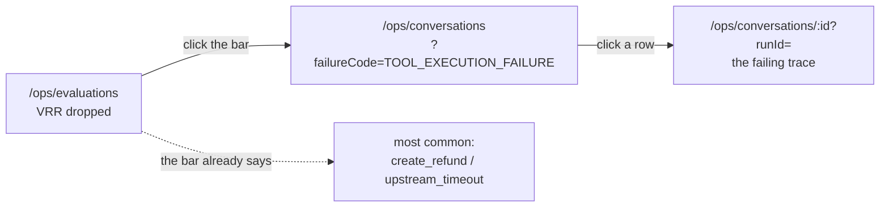

# Frontend

Next.js App Router, React 19, Tailwind v4, shadcn primitives and beUI agent
surfaces. Server components read the database through `@kora/db` repositories
directly; client components talk to the HTTP API.

## Screens

| Route | Who | What |
|---|---|---|
| `/` | anyone | Landing, links to chat and ops |
| `/chat` | customer | Creates a conversation and redirects |
| `/chat/:id` | customer | The transcript and composer |
| `/login` | operator | Email and password |
| `/ops` | operator | Metric cards and recent runs |
| `/ops/evaluations` | operator | Metrics, VRR trend, failure breakdown |
| `/ops/conversations` | operator | Filterable, keyset-paged run list |
| `/ops/conversations/:id` | operator | Trace inspector |
| `/ops/approvals` | operator | Approval queue |

`/ops/layout.tsx` calls `currentOperator()` server-side and redirects to
`/login?next=/ops` when there is no session. Hiding a link is not authorization, so
every operator API route checks the session again.

## The customer chat

`components/kora/chat-transcript.tsx` holds the whole interaction. It posts to
`/api/chat/:id`, waits for the complete turn, and appends one assistant message built
from the `TurnDto`.

What the customer sees is deliberately narrow. `components/kora/tool-part.tsx` maps
each tool name to a plain-language title and outcome. Policy rule ids, confidence
scores and raw tool arguments never leave the operator trace. An unhandled part type
renders `null` rather than crashing.

Approvals appear in the transcript as a read-only "a colleague is reviewing this"
card. The customer cannot decide their own approval; that lives on `/ops/approvals`.

Accessibility and motion: the transcript viewport is `aria-live="polite"`, the
composer disables while a turn is in flight, and `globals.css` carries a
`prefers-reduced-motion` reset on top of the reduced-motion handling the beUI
components already ship.

## The trace inspector

Three columns on desktop, stacked tabs below `lg`.

- **Left** — the conversation, using the same `Message` and `MessageBubble`
  components the customer saw.
- **Centre** — `components/kora/trace-timeline.tsx`. One entry per `run_steps` row in
  ordinal order. State transitions are headings; tool executions and policy checks
  are `
` that expand to full JSON. Executed, replayed, simulated, denied and
  failed rows each get their own left border and their own `data-testid`, because
  confusing "we chose not to" with "it failed" is the usual way an agent trace gets
  misread.
- **Right** — retrieved chunks in Beautiful UI context cards, then either the
  evaluation panel or, if the run escalated, the full `HandoffPayload`.

A run still in progress renders what exists, shows a live indicator, and does not
error on a null `finished_at`. A run with no evaluation row yet shows "evaluating",
not a false negative.

## Component sourcing

shadcn primitives are in `components/ui`, beUI agent surfaces in `components/agents`
and `components/motion`, Beautiful UI operator surfaces in `components/ops`, and
Kora's own components in `components/kora`. The first three are registry-managed: do
not hand-edit them, and see `docs/decisions.md` for why they carry `@ts-nocheck` and
sit outside the lint scope.

## The evaluation dashboard

`/ops/evaluations`. Metric cards, a VRR trend line, and a bar per primary failure
code.

The whole screen exists for one path, and it is three clicks:

The bar label carries the most common detail behind that code, so the "which tool"
and "which error" hops happen before the first click rather than after it.

`components/ops/failure-chart.tsx` draws the bars as linked `<li>` elements rather
than a Recharts `BarChart`. Every bar has to be a real navigation, and an SVG rect
is not a link. The trend line is Recharts, through the shadcn `chart` wrapper, and
is the only chart on the screen that does not need to be clicked through.

A rate over no eligible runs renders as "no data". `n` and the pending count sit
next to the VRR, because a percentage over eleven runs is not a number to act on.

## The conversation explorer

`/ops/conversations`. Started at, customer, intent, state, outcome, verified
resolution as a pass or fail chip, primary failure code, escalated, duration, cost.

Filters are a plain `<form method="get">`. The server component reads
`searchParams`, so a filtered list is a URL that can be pasted into a ticket, and no
client state has to be kept in sync. Four saved views sit above it: failed today,
escalated and unclaimed, policy violations, over latency budget.

A bare `to=2026-08-27` means the whole of that day, not midnight. Without that, the
drill path from a failure bar returns nothing on the day the failures happened.

Only "Load more" is client-side: `components/ops/conversation-table.tsx` holds the
accumulated rows and the cursor, and refetches `/api/conversations` with the same
filters plus `cursor=`.

## The approval queue

Sorted by money at risk, highest first. Elapsed time since the request is shown on
every row and ticks every 30 seconds; anything past half its TTL is marked in the
destructive colour, on both the row and the detail panel.

Opening the page expires anything overdue before rendering, so a row that reads
"pending" is genuinely still decidable. A decided or expired approval still opens,
without the approve and deny buttons, because approvals are never deleted.

A 409 or 410 from the decision route becomes a toast carrying the server's message
— which names the operator who got there first — followed by `router.refresh()`.

## Shadow mode and versions

Two more screens under `/ops`, both behind an operator session.

**`/ops/shadow`** shows agreement between what the agent proposed and what a
person actually did, per intent for the day, plus disagreements ranked by value
at risk. Runs nobody handled show as "Nobody handled it" and are excluded from
the agreement rate rather than counted as agreement.

**`/ops/versions`** lists agent versions, the promotion history with the note
that accepted each regression, and a rollback button. Rollback is one click and
has no gates: the moment you need it is the moment nobody has time to argue with
a checklist. It posts to `/api/agent-versions/rollback`, which resolves the
operator from the session, so the promotion row names a person.

Promotion itself is not a button. It needs a benchmark id, a replay id and an
explicit note per accepted regression, which is a command line shape, not a form:
`pnpm kora agent:promote --version <id> --actor <email>`. The page says so and
lists what the gates require.
