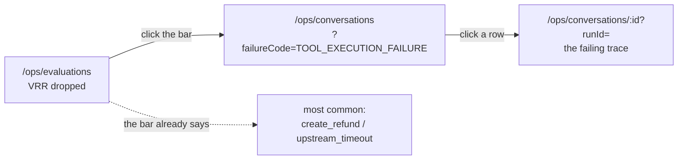

# Frontend

Next.js App Router, React 19, Tailwind v4, shadcn primitives and beUI agent
surfaces. Server components read the database through `@kora/db` repositories
directly; client components talk to the HTTP API.

## Screens

| Route | Who | What |
|---|---|---|
| `/` | anyone | Landing, links to chat and ops |
| `/chat` | customer | Creates a conversation and redirects |
| `/chat/:id` | customer | The transcript and composer |
| `/login` | operator | Email and password |
| `/ops` | operator | Is it working right now |
| `/ops/evaluations` | operator | Metrics, VRR trend, failure breakdown |
| `/ops/conversations` | operator | Filterable, keyset-paged run list |
| `/ops/conversations/:id` | operator | Trace inspector |
| `/ops/approvals` | operator | Approval queue |
| `/ops/shadow` | operator | Agent proposals against what a person did |
| `/ops/versions` | operator | Which agent config is live |

The deployment mode sits in the operator header on every route. Every mode below
`full` holds something back, so `full` is the one drawn in the destructive colour:
it means the agent acts on a real customer's order without asking.

`/ops/layout.tsx` calls `currentOperator()` server-side and redirects to
`/login?next=/ops` when there is no session. Hiding a link is not authorization, so
every operator API route checks the session again.

## Numbers are tiles, not cards

A card is for something with internal structure: a conversation, an approval, a
trace step. A label with a number is a tile, and tiles share one bordered strip
with dividers between them. `components/kora/stat.tsx` has the three pieces:

- `HeroStat` — one per page, the number the page exists to produce, at `text-4xl`
  with its denominator on the same line.
- `StatBar` — the strip. It takes a column count and throws in development when
  the tile count does not divide into it, because the fix for a partial row is
  always to change the column count, never to leave the gap.
- `Tile` — a fixed 76px band: label, value, one qualifying line.

Nine numbers in nine bordered cards is roughly nine hundred vertical pixels of
mostly padding and leaves an orphan on the last row at four columns. The same
nine as a hero plus a strip is about three hundred.

## The customer chat

`components/kora/chat-transcript.tsx` holds the whole interaction. It posts to
`/api/chat/:id`, waits for the complete turn, and appends one assistant message built
from the `TurnDto`.

An empty conversation is not a blank page. The header carries the merchant name and
one line on what this handles; the agent opens with a greeting and three starters.
A customer who lands here with no context still knows what it is and what to type.

What the customer sees is deliberately narrow. `components/kora/tool-part.tsx` maps
each tool name to a plain-language title and outcome. Policy rule ids, confidence
scores and raw tool arguments never leave the operator trace. An unhandled part type
renders `null` rather than crashing.

Approvals appear in the transcript as a read-only "a colleague is reviewing this"
card. The customer cannot decide their own approval; that lives on `/ops/approvals`.

Accessibility and motion: the transcript viewport is `aria-live="polite"`, the
composer disables while a turn is in flight, and `globals.css` carries a
`prefers-reduced-motion` reset on top of the reduced-motion handling the beUI
components already ship.

## The trace inspector

It leads with the verdict. `components/kora/trace-verdict.tsx` renders one banner
directly under the header: the outcome, the one sentence explaining it, and the rule
and policy version behind it. Amber when a person is needed, red for a denial or a
failure, green for a verified resolution. It sits above the columns because it is the
answer to the question the operator arrived with, and an answer inside a column that
scrolls is an answer nobody reads.

Below it, three columns on desktop, stacked tabs below `lg`.

- **Left** — the conversation, using the same `Message` and `MessageBubble`
  components the customer saw.
- **Centre** — `components/kora/trace-timeline.tsx`. One entry per `run_steps` row in
  ordinal order, grouped under the state it ran in. A state group with nothing under
  it is dropped rather than drawn as a heading over an empty region.

  A policy check renders inside the tool card it gated. The check that blocked
  `create_replacement` belongs in that card, not in a flat list five rows below it.

  Executed, replayed, simulated, denied and failed rows each get a coloured dot, a
  word and a `data-testid`, and the legend under the timeline names all four.
  Confusing "we chose not to" with "it failed" is the usual way an agent trace gets
  misread, and colour without a legend is decoration.

  Tool cards summarise as `get_order(9832) -> delivered, INR 8,999` and open to the
  JSON on click. Three panes open by default hide the thing they are evidence for.
- **Right** — retrieved chunks in Beautiful UI context cards, then either the
  evaluation panel or, if the run escalated, the full `HandoffPayload`.

A run still in progress renders what exists, shows a live indicator, and does not
error on a null `finished_at`. A run with no evaluation row yet shows "evaluating",
not a false negative.

## Component sourcing

shadcn primitives are in `components/ui`, beUI agent surfaces in `components/agents`
and `components/motion`, Beautiful UI operator surfaces in `components/ops`, and
Kora's own components in `components/kora`. The first three are registry-managed: do
not hand-edit them, and see `docs/decisions.md` for why they carry `@ts-nocheck` and
sit outside the lint scope.

## The evaluation dashboard

`/ops/evaluations`. A hero strip, eight tiles across four columns, and a bar per
primary failure code. The trend line renders only at two or more days of evaluated
data; below that the note goes on the right of the hero strip and no chart container
is drawn at all, because a 250px bordered box holding one point is not a trend.

The whole screen exists for one path, and it is three clicks:

The bar label carries the most common detail behind that code, so the "which tool"
and "which error" hops happen before the first click rather than after it.

`components/ops/failure-chart.tsx` draws the bars as linked `<li>` elements rather
than an SVG chart. Every bar has to be a real navigation, and a rect is not a link.
Length is frequency and colour is severity: a `POLICY_FAILURE` with a count of two is
the most serious thing on the page and stays the loudest row despite the shortest
bar, with a minimum bar width so it is still visible and clickable.

The trend line goes through `components/charts/chart.tsx`, the only file allowed to
import `@tanstack/charts`. The library is pre-alpha and its own docs say the API may
change between minor releases, so the version is pinned without a caret and an
upgrade or a swap to something else is one file.

A rate over no eligible runs renders as "no data". `n` and the pending count sit
next to the VRR, because a percentage over eleven runs is not a number to act on.

## The conversation explorer

`/ops/conversations`. Seven columns: started, intent, state, verified, primary
failure, duration, escalated. Customer holds the same value on every row in this
dataset and cost is stored in micro-dollars; both say more in the row detail than in
a column.

The filter bar is the ReUI filter primitive, one chip per URL parameter, joined by an
implicit AND. The URL stays the source of truth, so a filtered list is still a link
that can be pasted into a ticket, and a saved view, a drill-in from a failure bar and
a chip edit all land in the same place. Saved views are a segmented control above the
chips, visibly not a filter: failed today, escalated unclaimed, policy violations,
over latency budget.

Started is a relative window (`days=7`) rather than a from/to pair. A window survives
being bookmarked where two absolute dates go stale overnight, and the failure-bar
drill link speaks the same parameter, so arriving from a bar renders a chip the
operator can see and clear. A date range no control could draw was a filter with no
off switch.

The table is the ReUI data grid, virtualized and sortable.
`components/ops/conversation-table.tsx` holds the accumulated rows and the cursor and
refetches `/api/conversations` with the same filters plus `cursor=` when the grid asks
for more. Paging is keyset, so a run that arrives while you are reading does not shift
the rows below you.

## The approval queue

Sorted by money at risk, highest first, with the amount leading each row at the size
a number that decides something deserves. Elapsed time ticks every 30 seconds and
anything past half its TTL is marked amber, on both the row and the detail panel:
waiting too long is a warning, not a failure.

The chip groups are labelled. Status, value at risk and proposed tool are three
different questions, and an unlabelled row of bands leaves "under 1k" of what.

With nothing pending the page renders an empty state that names the rule which
decides, rather than one grey sentence above nine hundred pixels of white.

Opening the page expires anything overdue before rendering, so a row that reads
"pending" is genuinely still decidable. A decided or expired approval still opens,
without the approve and deny buttons, because approvals are never deleted.

A 409 or 410 from the decision route becomes a toast carrying the server's message
— which names the operator who got there first — followed by `router.refresh()`.

## Shadow mode and versions

Two more screens under `/ops`, both behind an operator session.

**`/ops/shadow`** shows agreement between what the agent proposed and what a
person actually did, per intent for the day, plus disagreements ranked by value
at risk. A run nobody handled is not a disagreement, so it is filtered out of that
table and reported as the count of skipped runs on the agreement tile, where it
qualifies the number it belongs to.

**`/ops/versions`** leads with the live version as a hero strip: version, model,
when it was activated and a copyable id. Below it the version list and the promotion
history, with the note that accepted each regression.

Rollback is one click and has no gates: the moment you need it is the moment nobody
has time to argue with a checklist. It posts to `/api/agent-versions/rollback`, which
resolves the operator from the session, so the promotion row names a person. With
nothing archived to roll back to, the button stays and says why in its tooltip.

Promotion itself is not a button. It needs a benchmark id, a replay id and an
explicit note per accepted regression, which is a command line shape, not a form:
`pnpm kora agent:promote --version <id> --actor <email>`. The promote button carries
those preconditions in its tooltip, next to the control they gate, rather than as a
paragraph of body copy explaining a control that is not there.
