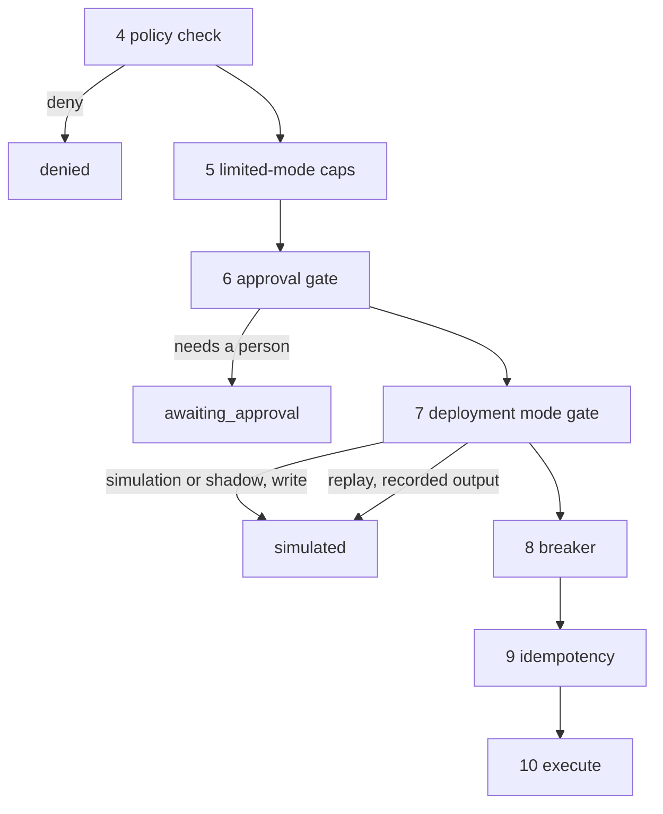
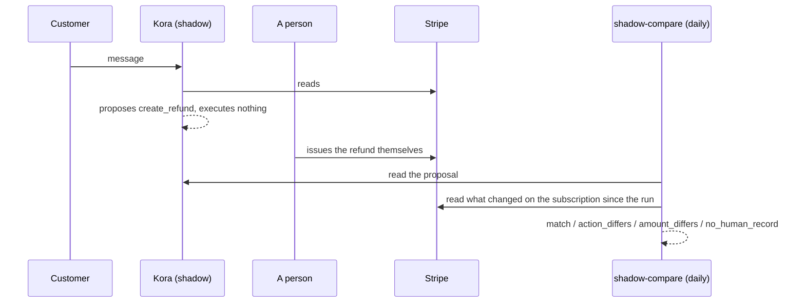

# The deployment ladder

Five rungs, one setting: `tenants.deployment_mode`, overridable per run.

```
simulation  ->  shadow  ->  human_approval  ->  limited  ->  full
```

Without a ladder the only two options are "off" and "autonomous in production",
and every customer picks off. The intermediate rungs are what make adoption
possible.

## What each rung does

| Mode | Reads | Writes | Approvals |
|---|---|---|---|
| `simulation` | live | never execute, return a synthetic output | not created |
| `shadow` | live | never execute, return a synthetic output | created, and that is the point |
| `human_approval` | live | execute | every `write_high` goes to a person |
| `limited` | live | execute within caps | policy decides, plus anything over a cap |
| `full` | live | execute | policy decides |

Replay is `simulation` with the original run's recorded outputs supplied, so
reads do not go to the live system either.

## Where the gate sits, and why



The mode gate runs **after** the approval branch. Put it earlier and a write
that policy sends to a person comes back as a silent simulated success, so the
run looks resolved when in production it would have stopped. That erases the one
thing replay and shadow exist to measure.

A write must never reach stage 10 in shadow mode. Stage 7 is the only path it
can take, so there is an assertion just before execution that throws if one gets
there. It is unreachable by construction, which is exactly why it is worth
asserting: an unreachable branch that becomes reachable is otherwise silent.

## Limited-mode caps

Three columns on `tenants`: `max_actions_per_day`, `max_value_minor_per_action`,
`max_value_minor_per_day`. Null means no cap.

Exceeding one **escalates**. It does not fail. A rung that hard-fails is a rung
operators skip, and the whole point of `limited` is that it is a step people are
willing to take.

Caps are enforced in the pipeline, never in a prompt. The spend is counted from
what actually landed — `ok` or `replayed` — so a denied or failed attempt costs
nothing against the cap. The amount comes from the `policy_checks` row for the
same action, because that is where the value was priced from records. Reading it
off the tool input would let the model set its own cap.

## Shadow comparison



The ground truth would be sound precisely because shadow mode writes nothing:
anything on the subscription after the run was done by someone else.

Two rules keep the number honest:

- **No human record is skipped, not counted as agreement.** Counting it would
  make an untouched queue look like a perfect agent.
- **Amounts are only compared for refunds.** A cancellation and a plan change
  carry no money on the action itself, so pricing the proposal but not the record
  would report every matched cancellation as a disagreement over nothing.

Disagreements are ranked by value at risk. The expensive ones are the ones worth
reading.

**The last read in that diagram does not happen yet.** Reading what a person
actually did now means reading Stripe, and only `packages/tools` may do that. No
tool exposes "what changed on this subscription since T", so
`services/worker/src/jobs/shadow-compare.ts` records every proposal with a null
actual. Because a null actual is *skipped* rather than counted as agreement, the
agreement rate stays honest — it is simply computed over nothing, and the skipped
count on `/ops/shadow` is the whole population. Closing this needs a
"changes since" read tool behind the chokepoint.

## Promotion

Four gates, checked before anyone can promote:

| Gate | Why |
|---|---|
| the benchmark passed | shipping past it ships a known regression |
| replay covered at least 500 conversations | a thin replay ships an unmeasured one |
| no verified-resolution regression | the headline number moved the wrong way |
| every regression explicitly accepted with a note | otherwise it ships one nobody looked at |

Promotion archives the old version and activates the new one in a transaction,
recording the benchmark and replay ids. Rollback has no gates and needs no
redeploy: in-flight runs finish on the version they started with, because a run
pins its version at start.
