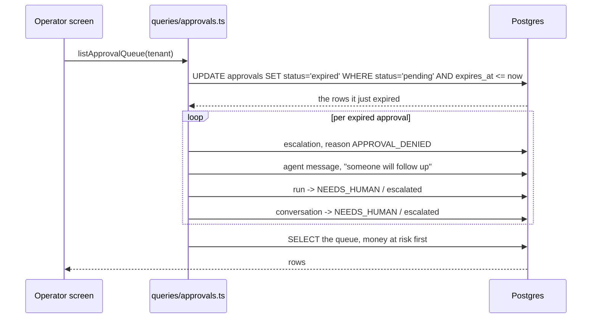

# The query layer

`packages/db/src/queries/` holds the read paths that the operator screens need and
repositories do not cover: aggregates, keyset pagination, and the money-at-risk sort
on the approval queue. Repositories stay row-shaped and tenant-closed; queries are
set-shaped and take the tenant as an argument.

Three modules, all exported through `@kora/db`.

| Module | What it answers |
|---|---|
| `metrics.ts` | Is the agent working, and what broke |
| `conversations.ts` | Which run out of thousands do I need |
| `approvals.ts` | What decision is waiting, and has it expired |

Each one exports its SQL builders (`runAggregateSql`, `conversationPageSql`,
`failureBreakdownSql`, `approvalQueueSql`) as well as the async wrappers. The
performance test runs `EXPLAIN` over the exact SQL the application runs, rather than
over a hand-written copy that could drift from it.

## Metrics are computed live

No rollup table and no scheduled job. `computeMetrics` runs four aggregates in
parallel over `agent_runs`, `evaluations`, `evaluation_results` and
`tool_executions`, all narrowed by `(tenant_id, started_at)`.

Four rules decide what the numbers mean, and each exists because the obvious version
of the metric is misleading.

**Cost per resolution divides by verified resolutions.** An agent that resolves less
gets cheaper per conversation. Dividing by conversations rewards that. Dividing by
verified resolutions does not: it goes up when the agent stops fixing things.

**Runs whose intent was `OUT_OF_SCOPE` or `HUMAN_REQUEST` are excluded.** They were
never the agent's to resolve. Counting them makes the resolution rate track how many
people asked for a human. They are reported separately as coverage.

**A run with no evaluation row yet is pending, not a failure.** Evaluation is
scheduled with `after()` and lands a moment after the turn. Counting the gap as
failure would make every dashboard dip whenever traffic arrives.

**A rate over zero eligible runs is `null`, and renders as "no data".** Never `0%`,
never `NaN`.

The range is capped at 90 days. Beyond that the API returns 400 rather than scanning
the table and timing out. When that cap starts to hurt, that is the signal to build
the rollup.

### The failure breakdown

`failureBreakdownSql` counts `failure_codes[1]` only. The classifier writes every
code it finds, in root-cause order, so a single broken retrieval also produces a
hallucination and a bad outcome. Counting all of them would make the tallest bar the
symptom furthest from the fix.

`topDetail` is recomputed from the trace, because the classifier's detail string is
not persisted next to the code. Tool failures resolve to the last failed
`tool_name / error_code`, policy failures to the last non-allow `rule_id`, and
everything else to the run's intent. `mode()` picks the most common one per bucket.

That string is what turns a bar into a lead: `TOOL_EXECUTION_FAILURE, 117, most
common: get_subscription / upstream_4xx`.

## Conversations page by keyset, not offset

```sql
WHERE (started_at, id) < (cursor_ts, cursor_id)
ORDER BY started_at DESC, id DESC
LIMIT n
```

Offset pagination on a table that grows gets slower every week, and a run inserted
while somebody is on page three shifts every later page by one row, so one row is
never seen. Keyset paging has neither problem: a new run sorts above the cursor, so
paging simply never reaches it.

The cursor is `base64url("<iso>|<runId>")`. `decodeCursor` returns `null` rather than
throwing, and the route turns that into a 400 with a message that says to start from
the first page.

## Approval expiry is lazy

An approval past `expires_at` is treated as expired the moment it is read or decided.
`readApproval`, `listApprovalQueue` and `decideApproval` all call
`expireOverdueApprovals` first, so the queue can never show a stale pending row and a
decision on an expired approval can never win.

Expiry is not just a status change. It also hands the conversation to a person:



`pnpm kora approvals:expire` calls the same `expireOverdueApprovals`. The lazy path
and the sweep are one function, so they cannot disagree.

A decision is still a conditional `UPDATE ... WHERE status = 'pending'`. That single
statement is the lock: the second of two simultaneous decisions matches no row, and
`decideApproval` returns `conflict` with the recorded decision and the name of the
operator who made it. The route turns that into a 409, and an expired approval into a
410.

Approvals are never deleted. An expired one stays readable under `status=expired`.

### Money at risk

The queue sorts by money descending, because the expensive decision is the one that
should be looked at first. The amount is a policy fact first and a tool argument
second: the policy engine priced the action from the charge record, and
`cancel_subscription` carries no amount at all. Both live in `jsonb`, so the type
is checked before the cast:

```sql
case when jsonb_typeof(pc.facts -> 'amountMinor') = 'number'
  then (pc.facts ->> 'amountMinor')::bigint end
```

## Indexes

`packages/db/migrations/0004_ops_query_indexes.sql`.

| Index | Serves |
|---|---|
| `agent_runs (tenant_id, started_at DESC, id DESC)` | every metric, and the explorer cursor |
| `agent_runs (tenant_id, agent_config_version, started_at DESC)` | metrics for one config version |
| `agent_runs (tenant_id, intent, started_at DESC)` | metrics and filters by intent |
| `agent_runs (tenant_id, outcome, started_at DESC)` | the outcome filter |
| `evaluations (tenant_id, verified_resolution)` | the verified filter |
| `evaluations (tenant_id, (failure_codes[1]))` | the failure code filter and the breakdown |
| `evaluation_results (check_id, verdict)` | policy compliance and grounding rates |
| `approvals (tenant_id, status, expires_at)` | the queue and the lazy sweep |
| `approvals (tenant_id, decided_at DESC)` | decided today |
| `escalations (run_id, status)` | the escalated and unclaimed filters |

These are in the migration but not yet in the drizzle schema files, so
`drizzle-kit generate` does not know about them. They need adding to
`src/schema/runs.ts`, `evaluations.ts`, `approvals.ts` and `escalations.ts` before
the next generated migration.
