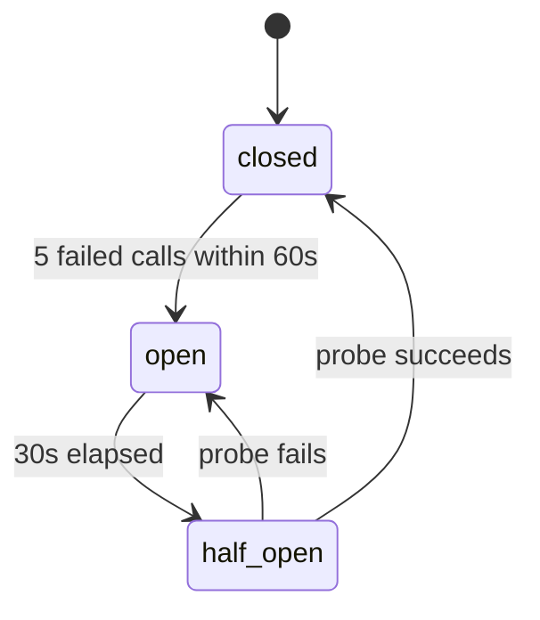

# Reliability primitives

Every dependency fails eventually. What matters is whether a failure produces a
wrong business action or a safe escalation. Four pieces decide that: one retry
table, circuit breakers, model fallback and a rate limiter.

## The retry table

`packages/core/src/retry.ts` holds the only retry policy in the codebase. Nothing
writes its own loop constants any more.

| Class | Attempts | Backoff | Base | Never retried on |
|---|---|---|---|---|
| `model_call` | 2 | exponential | 250ms | 4xx except 429 |
| `read_tool` | 3 | exponential | 250ms | 4xx |
| `idempotent_write` | 2 | exponential | 250ms | 4xx |
| `non_idempotent_write` | 1 | none | – | everything |
| `embedding_batch` | 2 | linear | 500ms | 4xx |
| `queue_job` | 5 | exponential | 2s | validation errors |

`backoffMs(policy, attempt)` picks uniformly from `[0, ceiling)` — full jitter, so
every caller that failed at the same moment does not wake at the same moment. The
ceiling is capped at `BACKOFF_CAP_MS` (30s).

`isRetryable(class, error)` is the same decision written once. A class with one
attempt returns `false` for everything, which is how "never retry a non-idempotent
write" is enforced rather than remembered.

## Timeout budget

The budget is spent top down, and no layer assumes its own:

```text
request        60s   (Next route maxDuration)
  agent run    45s   (KORA_RUN_DEADLINE_MS, carried as ctx.deadlineAt)
    model call 20s   (TIMEOUT_BUDGET_MS.modelCall, an upper bound on what a caller asks for)
    tool call  as declared by the tool, clamped by budgetedTimeoutMs to what is left
```

`budgetedTimeoutMs(declaredMs, deadlineAt)` returns the smaller of the two and never
a negative number, so an inner layer can only shrink the budget it was handed.

## Circuit breakers

`packages/tools/src/breaker.ts`. State lives in Redis so every process sees the same
breaker, keyed per `(tenant, tool)` and per model provider.



A failure is counted **once per tool call, not once per attempt**. The retry table
already bounds attempts; counting each of them would open the breaker on the second
failed call and make the table meaningless. Only `UPSTREAM_5XX` and `UPSTREAM_TIMEOUT`
count — a 404 or a malformed body says nothing about whether the dependency is up.

When the breaker is open the pipeline fails fast with `UPSTREAM_5XX` before the
idempotency claim, writes the `tool_executions` row so the trace shows why nothing
happened, and lets the agent escalate. Acme is never called.

A breaker whose `since` marker is more than ten minutes old is logged at error with
`code: BREAKER_STUCK_OPEN`, at most once a minute. There is no alerting yet.

### Listing what is open

`listOpen()` backs `/api/status` and the `breaker_open` alert. It walks the
keyspace with `SCAN`, not `KEYS`: it runs once a minute and on every status page
load, and `KEYS` blocks the whole Redis server for the length of the keyspace.

The duration comes from a `:since` marker that survives re-opens, so it reports
how long the dependency has actually been down rather than time since the last
failed probe. A flapping dependency would otherwise never look stuck.

## Graceful degradation ladder

The rungs, in the order a dependency is allowed to fail. The ladder is written as a
comment at the point it is enforced, in `executeTool`.

| Dependency down | What happens |
|---|---|
| Retrieval | Answer from tool results only, never from memory. `search_knowledge` fails like any other read and anything needing policy escalates. |
| Business API | Say so plainly and escalate. The breaker gate plus the `TOOL_FAILED` handover in `@kora/ai`. |
| Models | Static holding message and escalate. Never queued silently. |
| Redis | **Fail closed on writes.** A write never runs while we cannot tell a healthy dependency from a downed one. Reads go ahead. |

The Redis rung is the one worth spelling out. The idempotency store is Postgres, so
a Redis outage does not by itself make a write unsafe. What it does is remove our
only way to tell "this dependency is healthy" from "this dependency is down", and a
duplicated or unrecorded business action cannot be taken back. For a read the worst
case of going ahead is a slow failure, which is acceptable.

## Model fallback

`packages/ai/src/fallback.ts`. `KORA_MODEL_AGENT_FALLBACK` names a second provider
for the **agent role only**. When the primary exhausts its two attempts on a
retryable error, the fallback gets one attempt.

Two things make the fallback visible rather than silent:

- the log line carries `code: model.fallback_used` with both model ids
- the `llm_calls` row records `provider` as `fallback:<provider>`

A silent fallback hides a provider outage — the primary can be down all day while
every answer still looks fine.

**The judge never falls back.** Changing the judge model changes what the scores
mean, so numbers recorded before and after a swap stop being comparable and the
calibration set no longer applies. This is enforced, not documented: `judge-caller.ts`
calls the SDK directly and never goes through the gateway, `fallbackModelFor` returns
`null` for any role but `agent`, and a fallback id that is the judge model is
rejected at resolution time.

When the variable is unset there is no fallback and behaviour is exactly as before.

## Rate limiting

`apps/web/lib/rate-limit.ts`. A Redis sliding window — a sorted set of request
timestamps — per tenant and route class.

| Class | Limit | Window | Keyed on | Applied in |
|---|---|---|---|---|
| `chat` | 30 | 60s | conversation id | the chat route |
| `ops` | 300 | 60s | operator id | `requireOperator()` |
| `auth` | 10 | 60s | client address | the Better Auth route |

Each is applied at the one place every route in its class already passes through,
so a new route inherits the limit instead of needing someone to remember it.
`ops` is keyed on the operator rather than the address, because an operator
behind a shared address should not be throttled by a colleague. `auth` is keyed
on the address, because the caller there has no session yet — which is the whole
point of limiting it. Redis being unreachable does not lock people out of signing
in: the auth limiter fails open, deliberately, since the alternative is an outage
caused by the thing meant to prevent one.

A fixed counter lets a caller spend the whole budget at the end of one window and
again at the start of the next. The sorted set counts the last `windowMs` wherever
the boundary falls. A denied request is not added to the set, so a client that keeps
hammering does not push its own recovery further away.

Denials return 429 with `Retry-After`. If the model provider's breaker is open at the
same time, the breaker's error wins: a rate limit says "wait a minute", an open
breaker says "the dependency is down", and the second is the more actionable answer.
