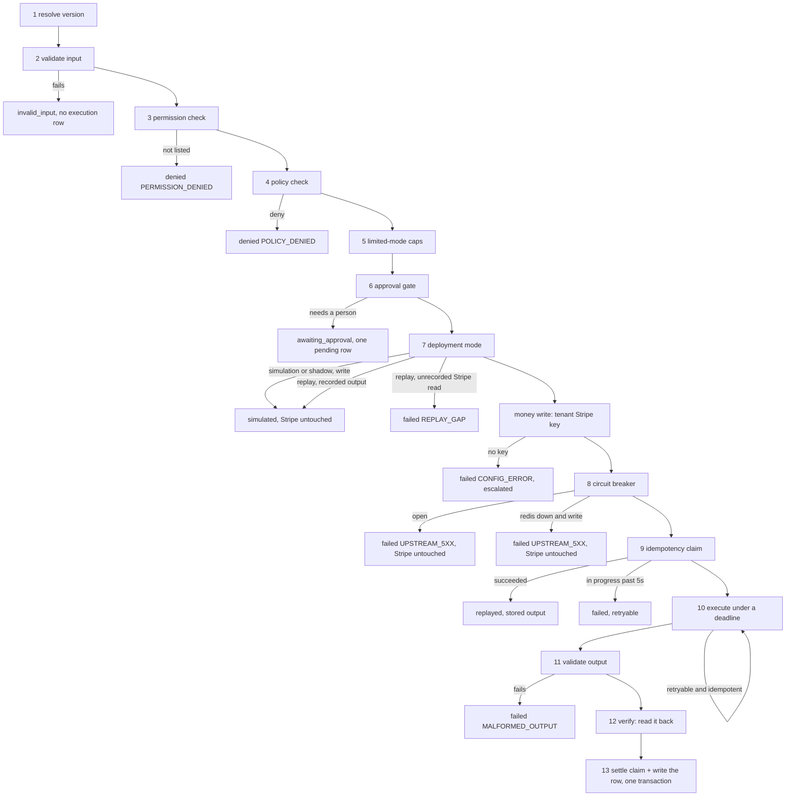
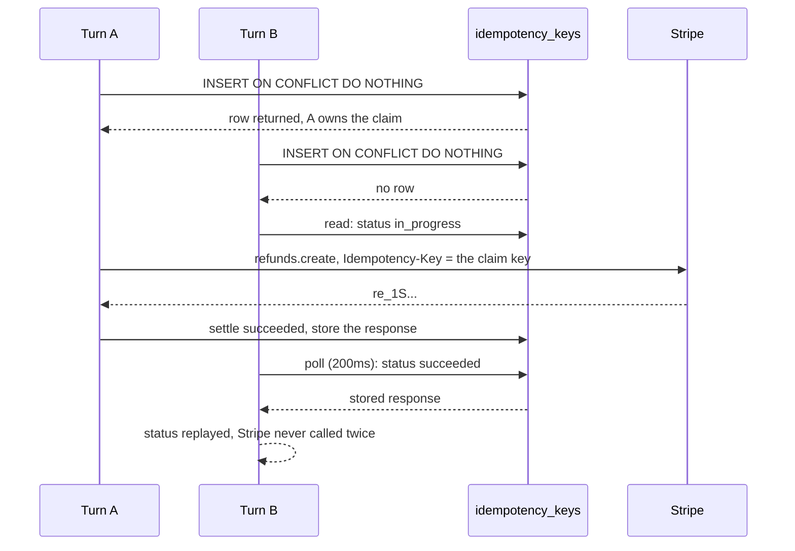

# The tool execution pipeline

`packages/tools/src/pipeline.ts`. Every action the agent takes goes through
`executeTool`, and nothing reaches Stripe any other way.

Thirteen stages in a fixed order, and the order is the point. A policy check
after execution is not a policy check, and a mode gate before the approval branch
turns a write that needed a person into a silent success.

## Why each stage sits where it does

**1. Resolve version.** The agent config pins `{name, version}`. A registry that
has drifted to a different version fails here rather than silently calling a
schema nobody tested against.

**2. Validate input.** A bad shape returns the zod issues to the model so it can
correct itself. No `tool_executions` row is written, because nothing was
attempted.

**3. Permission check.** Fail closed. A tool that is not explicitly in
`allowedTools`, or whose `requiredPermission` is not granted, is denied. There is
no default-allow path.

**4. Policy check.** Facts are built by `facts.ts` from tool results and database
rows, never from model text. A `policy_checks` row is written **every time**,
including on `allow` — missing allow records make later auditing impossible.

It runs before the mode gate, not after, because simulation and shadow both have
to show what the policy engine *would* have decided. A replay that skipped policy
evaluation would be comparing nothing.

**5. Limited-mode caps.** In `limited` mode only. Spend is counted from what
actually landed, and the amount comes from the policy check rather than the tool
input, so the model cannot set its own cap. Exceeding one escalates; it never
fails. See [the deployment ladder](./deployment-ladder.md).

**6. Approval gate.** Policy said `require_approval`, or `human_approval` mode
and a `write_high` tool, or a cap was exceeded. The decision is made against the
**conversation**, not the run: approving resumes the work in a new run, and that
run must not ask again.

**7. Deployment mode.** `simulation` and `shadow` return a synthetic output for
writes and never touch Stripe; reads still run. On replay every Stripe read and
write is served from the original run's recorded output instead, keyed by
canonical JSON, and a Stripe read the original run never made fails with
`REPLAY_GAP` rather than answering from today's state.

This sits **after** the approval gate on purpose. Earlier, and a write that
policy sends to a person comes back as a silent simulated success, which erases
the one thing replay and shadow exist to measure.

**The tenant key gate**, between the mode gate and the breaker, applies only to
`create_refund`, `cancel_subscription` and `change_plan`. A tenant with no Stripe
key fails closed with `CONFIG_ERROR` and an escalation, before an idempotency
claim is burned or the breaker is consulted. It sits after the mode gate so a
simulation run still works for a tenant that has not connected Stripe yet.

A write must never reach stage 10 in shadow mode, and stage 7 is the only path it
can take. There is an assertion just before execution that throws if one gets
there: unreachable by construction, which is exactly why it is worth asserting.

**8. Circuit breaker.** A per `(tenant, tool)` breaker held in Redis, read before
the claim so a downed dependency costs one Redis read instead of an idempotency row
and a doomed HTTP call. Open means fail fast with `UPSTREAM_5XX`, and the
`tool_executions` row is still written so the trace shows why nothing was attempted.
If Redis itself cannot be read, a **write** is refused and a **read** goes ahead. See
[reliability.md](./reliability.md).

**9. Idempotency claim.** A single `INSERT ... ON CONFLICT DO NOTHING RETURNING`
against `idempotency_keys`. The database is the lock: no Redis, no
read-then-write, no distributed lock to operate.

**10. Execute.** Under `AbortSignal` set to the smaller of the tool timeout and
the remaining run deadline. Retries only when the tool is marked idempotent, the
error is retryable, and attempts remain. Attempts, backoff shape and base
interval come from `RETRY_POLICY` in `@kora/core`, keyed by the tool's retry class,
with full jitter on every wait.

**11. Validate output.** A business response that does not match the tool's output
schema is `MALFORMED_OUTPUT`, not a silent pass-through into the model's context.

**12. Verify.** If the tool declares `verify`, it runs inside the same deadline. A
verify that throws is treated exactly as `verified: false`: ambiguity resolves
toward a human, always. A tool with no `verify` stores `verified: null`. Absence
of verification is not verification.

**13. Settle.** The idempotency row and the `tool_executions` row are written in
one drizzle transaction, so a crash cannot leave a claim marked succeeded with no
record of what it did.

## Error codes

| Situation | Status | `error_code` |
|---|---|---|
| input fails the schema | `invalid_input` | none, issues returned |
| tool not in `allowedTools` | `failed` | `PERMISSION_DENIED` |
| policy denies | `denied` | `POLICY_DENIED` |
| policy requires approval | `awaiting_approval` | none |
| circuit breaker open for this tool | `failed` | `UPSTREAM_5XX`, not retryable |
| breaker store unreachable, write tool | `failed` | `UPSTREAM_5XX`, not retryable |
| simulation or shadow mode, write tool | `simulated` | none |
| replay, business read the original run never made | `failed` | `REPLAY_GAP`, not retryable |
| limited mode, a cap exceeded | `awaiting_approval` | none |
| duplicate claim, already succeeded | `replayed` | none |
| duplicate claim, still in progress past 5s | `failed` | `UPSTREAM_TIMEOUT`, retryable |
| upstream timeout after retries | `failed` | `UPSTREAM_TIMEOUT` |
| upstream 500 after retries | `failed` | `UPSTREAM_5XX` |
| upstream 404 | `failed` | `UPSTREAM_4XX`, not retried |
| output fails the schema | `failed` | `MALFORMED_OUTPUT` |
| deadline passed before execution | `failed` | `DEADLINE_EXCEEDED` |
| verify returns false | `ok` with `verified: false` | `VERIFY_FAILED` recorded on the row |

## Idempotency, in detail

The key is `sha256(tenant | conversation | tool | version | canonicalJson(input))`,
and that same string is sent to Stripe as its `Idempotency-Key` on every write.
Two independent layers: Kora's claim stops the second call before it leaves the
process, and Stripe's key means that even if one did leave, Stripe returns the
original result rather than acting twice.

Two details matter:

- **The input hash is in the key.** A retry with different arguments is a
  different action and must not deduplicate against the first.
- **The key is scoped to the conversation, not the run.** Approving a high-value
  action resumes the work in a new run, and a customer submitting twice creates
  two runs. Both have to land on the same key, or the second one writes again.

An owner that crashes without settling leaves the row `in_progress` until it
expires. Later callers wait five seconds, then return a retryable failure. They
**do not execute**. An orphaned claim is safer than a duplicate write.
