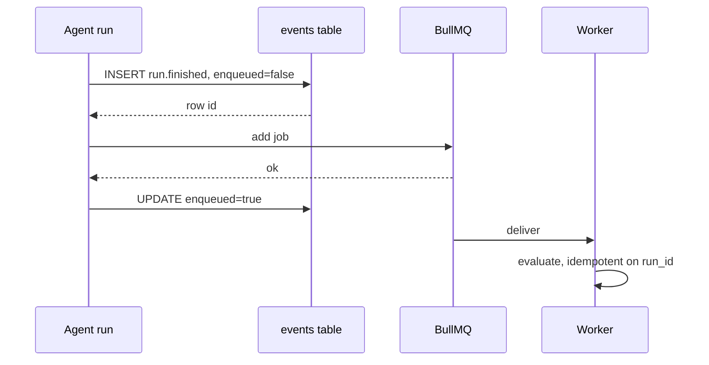

# Jobs and queues

`services/worker`. Three BullMQ queues on Redis, one process, one Redis
connection shared across every queue and worker in it.

| Queue | Concurrency | Work |
|---|---|---|
| `evaluation` | 5 | score a finished run |
| `ingestion` | 2 | embed and index a document |
| `maintenance` | 1 | the repeatable jobs below |

Concurrency is deliberately modest. Higher and the mock service plus provider
rate limits become the thing being measured.

## The event log comes first



The row is written **before** the enqueue. A lost job can be replayed from the
table; a lost row cannot be replayed from anywhere. If the enqueue throws, the row
stays `enqueued = false` and `replay-pending-events` picks it up within five
minutes. Evaluation is delayed, never dropped.

Re-delivery is safe. `evaluations` has a unique index on `run_id` and the upsert
is `ON CONFLICT DO NOTHING`, so a job delivered twice writes one evaluation.

## Repeatable jobs

Registered with `upsertJobScheduler`, not `repeat`. `repeat` accumulates a new
scheduler on every process start, and after a few deploys the same job runs
several times a minute.

| Job | Cadence | What it does |
|---|---|---|
| `expire-approvals` | every minute | marks overdue approvals expired |
| `evaluate-alerts` | every minute | runs the alert rules and delivers what is firing |
| `replay-pending-events` | every 5 minutes | re-enqueues events whose enqueue failed |
| `cleanup-idempotency` | hourly | deletes expired idempotency claims |
| `shadow-compare` | daily, 02:00 | pairs shadow proposals with what a person did |
| `purge-retention` | daily, 03:00 | deletes traces past `KORA_RETENTION_DAYS` |

`evaluate-alerts` runs every minute because the goal is knowing within a minute.
A slower cadence makes it a report rather than an alert.

The test that asserts every maintenance job has a scheduler derives its list from
`REPEATABLE` rather than hard-coding one, so adding a job cannot leave a stale
expectation that passes for the wrong reason.

## Failure

```ts
{ attempts: 5, backoff: { type: 'exponential', delay: 2000 }, removeOnFail: false }
```

Failed jobs are **kept**. A dead-lettered job nobody can read is a job silently
dropped. `GET /api/status` reports the failed count per queue and the
`dlq_not_empty` alert warns when any is non-zero.

**There is no listener that drains them.** They are visible and counted; nothing
replays them automatically yet. See
[Status](../00-overview/status.md#limitations).

## Running with no worker at all

The chat route calls `wireQueues()` once. If Redis is unreachable, `emit` records
the event without enqueueing and the route evaluates the run inline in an
`after()` hook. A single-process deployment therefore works with nothing else
running, and the same code path handles both cases.
