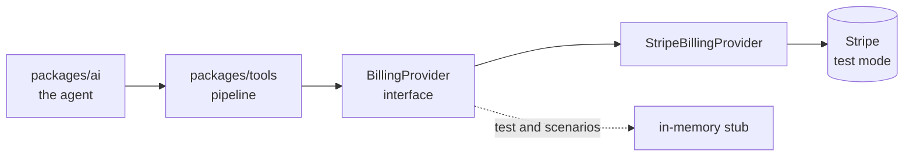

# Integrations

One: Stripe Billing, in test mode, through the official `stripe` Node SDK
(`stripe@22.6.1`, on the SDK's default API version `2026-08-26.dahlia`).

Stripe is the system of record. It holds the customers, subscriptions, invoices,
charges and refunds. Kora keeps its own run trail, but it never keeps a shadow
copy of the money.

## The chokepoint

Only `packages/tools/src/` may import the Stripe SDK or the provider behind it.
`scripts/check-billing-imports.ts` runs in `pnpm lint` and fails the build if
anything under `packages/`, `apps/` or `services/` imports `stripe`, or imports
`billing/provider`, `billing/stripe-provider`, `billing/types` or
`billing/index` by path.

Without it, one direct call slips in, then another, and the guarantee that every
write is policy-checked, idempotency-claimed and verified quietly stops being
true.

Everything above the chokepoint sees Kora's own record types, never a raw Stripe
object. The mapping happens in `packages/tools/src/billing/stripe-provider.ts`.



## SDK details that are not obvious

These moved across Stripe API versions, so they are recorded here rather than
rediscovered. All confirmed against the installed types.

- The preview call is `stripe.invoices.createPreview`. There is no
  `retrieveUpcoming` in this SDK.
- `current_period_start` and `current_period_end` live on the **subscription
  item**, not the subscription. The provider takes the latest
  `current_period_end` across items.
- Invoice-to-charge linkage runs through `invoice.payments[].payment`, which is
  either a payment intent or a direct charge. There is no `charge` field on the
  invoice in this API version, so `resolveChargeForInvoice` walks
  invoice → payment intent → `latest_charge`. If any step is missing, the refund
  cannot proceed: the missing fact is recorded and the run escalates rather than
  guessing at a charge.
- An immediate cancel is `stripe.subscriptions.cancel`, which takes no
  `at_period_end` parameter. Cancel-at-period-end is `stripe.subscriptions.update`
  with `cancel_at_period_end: true`.
- Request timeouts surface as `StripeConnectionError` with a "timed out" message,
  not as a distinct class, which is why the error mapping reads the message.
- An unknown status from Stripe throws `MALFORMED_OUTPUT` rather than being
  coerced. Guessing at a status is how a `pending` refund becomes a success.

## Authentication

One restricted key per tenant. It is encrypted with the secret helper in
`packages/core` and stored in `tenant_settings.stripe_secret_encrypted`, and set
with:

```bash
pnpm kora stripe:set-key --tenant <tenant_id> --key rk_test_...
```

The key is read at tool time, never from a per-request environment read.
`billingProvider(tenantId)` builds a `StripeBillingProvider` per tenant and
caches it for the life of the process, because the Stripe client it wraps is
built from that tenant's key — one shared client would serve every tenant with
whichever key resolved first. A rotated key therefore needs a process restart.

The runtime key needs Customers read, Subscriptions read and write, Invoices
read, Charges read, PaymentIntents read, Refunds read and write, and Products
and Prices read. It must not be able to create customers.

A tenant with no key cannot execute a money write. The pipeline gates
`create_refund`, `cancel_subscription` and `change_plan` on the key before it
claims an idempotency key or touches the circuit breaker, and a missing key
fails closed with `CONFIG_ERROR` and an escalation. Nothing reaches Stripe.

## Idempotency, twice over

Kora's claim key is
`sha256(tenantId | conversationId | toolName | toolVersion | canonicalJson(input))`.
That same string is passed to Stripe as its `Idempotency-Key` on every write.

Two independent layers on purpose. Kora's claim stops the second call before it
leaves the process; Stripe's key means that even if one did leave, Stripe returns
the original result rather than acting twice. A retry with different input is a
different action with a different key, which is correct. Stripe's keys expire
after 24 hours, which is fine for a single turn; nothing is built on top of that
window.

## Errors

Mapped at the provider boundary, so the pipeline only ever sees Kora codes.

| Stripe error | Kora code | Retryable | Counts toward the breaker |
|---|---|---|---|
| Connection error, API error (5xx) | `UPSTREAM_5XX` | yes | yes |
| Rate limit (429) | `UPSTREAM_5XX` | yes, with backoff | yes |
| Connection error reading "timed out" | `UPSTREAM_TIMEOUT` | yes | yes |
| Invalid request (400), no such resource | `UPSTREAM_4XX` | no | no |
| Idempotency error | `REPLAYED` | no | no |
| Authentication, permission, signature | `CONFIG_ERROR` | no | no |
| Card error | `CARD_ERROR` | no | no |

A `CONFIG_ERROR` means the tenant's key is wrong, revoked, or missing a scope. It
is a configuration fault, not a customer one: it escalates and never looks like a
customer-facing failure. It does not count toward the breaker, because a bad key
says nothing about whether Stripe is healthy.

## The webhook

`POST /api/webhooks/stripe`. It verifies the `stripe-signature` header against
`STRIPE_WEBHOOK_SECRET` — which accepts either a raw `whsec_…` value or a `v1.…`
blob from the secret helper — with a five-minute timestamp tolerance and a
constant-time compare. The route reads the raw request bytes, because parsing to
JSON first would re-serialize the body and break the signature.

Two event families, and everything else is ignored:

| Family | Events | What it does |
|---|---|---|
| Refund | `refund.created`, `refund.updated`, `refund.failed` | on `succeeded`, flips the execution's verification to confirmed and writes a `verify` step; on `failed` or `canceled`, escalates; anything else is recorded as still waiting |
| Subscription | `customer.subscription.updated`, `customer.subscription.deleted` | confirms a cancellation that has landed or is scheduled at period end |

Each `event.id` is claimed once in `stripe_webhook_events`, so Stripe's
redeliveries are no-ops. There is no general event bus, on purpose.

The endpoint is single-tenant: one global secret and one global tenant id
(`KORA_TENANT_ID`). See
[Status](../00-overview/status.md#what-is-not-proven).

## Testing against something that can fail

The tests and the acceptance suite drive an in-memory implementation of the same
`BillingProvider` interface, so the pipeline, policy, idempotency and verify
paths are exercised without a Stripe account.

`FaultInjectingBillingProvider` wraps any provider and injects transport faults —
`timeout`, `500`, `slow` — at a set rate. Only transport faults, because a fault
that changes stored state would make every read path non-deterministic and the
benchmark would stop measuring the agent.

The fault rate is a process-wide switch (`setBillingFaultRate`), because the
scenario runner installs a fresh provider per scenario and has to know whether
this pass is meant to be faulty.

The scenario stub seeds a fixed set of fixture keys, and
`packages/evaluation/test/scenarios.test.ts` fails if a scenario file names one
that does not exist:

| Key | What it is for |
|---|---|
| `recent-charge` | INR 3,499 paid recently — the happy path |
| `old-charge` | outside the 30-day refund window |
| `high-charge` | INR 8,999, at or above the approval threshold |
| `partial-charge` | INR 1,000 already refunded of INR 3,499 |
| `big-charge` | a large mid-cycle proration credit |
| `pending-charge` | a refund Stripe leaves `pending` |
| `unpaid-sub` | a subscription in `unpaid`, which needs approval to cancel |

## What has and has not run against Stripe

The fixtures are real. `pnpm kora stripe:fixtures` creates a Test Clock, three
customers with payment methods, three subscriptions and three paid invoices in a
test-mode account, and running it again changes nothing.

The tool pipeline is a different matter. Every test drives the provider through a
stub or a fake, so what is proven is that the code agrees with its own interface,
not that the interface agrees with Stripe. A moved field, a renamed parameter or a
differently shaped webhook payload would not be caught here.
