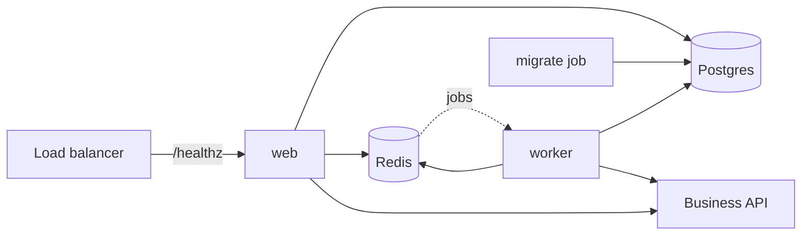

# Deployment

Three environments, three images, one migration rule. When something breaks, go
to [the runbook](../runbook.md).

## Environments

| | local | staging | production |
|---|---|---|---|
| Postgres and Redis | `infra/docker/docker-compose.yml` | managed | managed |
| Application | `pnpm dev` from source | the built images | the same built images |
| Business system | mock commerce on `:4001` | mock commerce | the real Acme API |
| Models | `KORA_MODEL_PROVIDER=mock` | real provider | real provider |
| Deployment mode | `full` | `full` | `human_approval` |

**Staging runs the same images as production.** Same tag, same
`docker-compose.prod.yml`, different environment variables. If staging needed a
different image it would not be testing anything.

Staging keeps the mock commerce service on purpose. It is the only way to
exercise faults, timeouts and stale reads deliberately without doing it to real
customer orders.

## What runs where



Three images, built from the repository root as the build context:

| Image | Dockerfile | Runs |
|---|---|---|
| `web` | `apps/web/Dockerfile` | `next start` on port 3000 |
| `worker` | `services/worker/Dockerfile` | the BullMQ worker under `tsx` |
| `mock-commerce` | `services/mock-commerce/Dockerfile` | the Acme stand-in on port 4001 |

Each is multi-stage, installs only the workspace subtree it needs
(`pnpm install --filter <pkg>...`), produces a pruned bundle with
`pnpm deploy --legacy --filter <pkg> --prod`, and runs as the `node` user.

Two details that are easy to break:

- The `@kora/*` packages read `config/` relative to their own source directory.
  In a deployed bundle each package sits under its own `node_modules`, so the
  worker image links `config` beside each of them. The web image keeps `config`
  at the build path, because the webpack build bakes `import.meta.dirname` in as
  an absolute path.
- `next.config.ts` imports `dotenv`, which is a dev dependency, and `next start`
  loads the config again at runtime. The web image copies `dotenv` back in after
  the pruned deploy.

The app is **not** built with `output: 'standalone'`. Standalone would remove
both of those workarounds, and it needs a change to `next.config.ts`.

### Running the images

```bash
export DATABASE_URL=... REDIS_URL=... BETTER_AUTH_SECRET=... ACME_API_KEY=...
docker compose -f infra/docker/docker-compose.yml \
               -f infra/docker/docker-compose.prod.yml up -d
```

The first file gives you Postgres and Redis, which staging and production do not
need. In those environments use `docker-compose.prod.yml` on its own.

## Migrations

**Migrations run as their own job, before the deploy, never on app boot.**

```bash
pnpm migrate:job          # bash infra/scripts/migrate-job.sh
```

The script takes a Postgres advisory lock, runs `pnpm kora migrate` inside that
session, and releases it. Two deploys that start at the same moment serialise:
the second waits for the first, with a five minute `lock_timeout` so it fails
loudly instead of hanging forever.

Nothing in the images runs a migration at start. The lock is the backstop for
when someone reintroduces one anyway.

DDL runs as the database owner (`DATABASE_URL`). The application connects as
`kora_app` (`DATABASE_APP_URL`), which owns nothing and cannot bypass row-level
security, so it cannot migrate even by accident.

### The backward compatibility rule

A migration has to be safe to run **while the previous release is still
serving**. During a rollout both versions are live at once.

So a column is added over two releases, never one:

| Release | Migration | Application |
|---|---|---|
| N | add the column, nullable, no default that rewrites the table | ignores it |
| N | — | backfill, in batches, as a job |
| N+1 | `set not null`, add the constraint | reads and writes it |

The same shape applies to everything else:

- **Renaming a column** is an add, a dual write, a backfill, then a drop three
  releases later. There is no safe single-step rename.
- **Dropping a column** waits one release after the last code that reads it has
  shipped.
- **Narrowing a type or adding a constraint** needs the data to already satisfy
  it, which means a backfill release first.
- **`CREATE INDEX`** on a table with real traffic must be `CONCURRENTLY`, which
  cannot run inside a transaction and therefore cannot be rolled back by the
  migration. Write it as its own migration file.

If a migration cannot be made backward compatible, it needs a maintenance window
and a plan, not a deploy.

## Health endpoints

| Endpoint | Who calls it | Answers |
|---|---|---|
| `GET /healthz` | the load balancer | 200 while the process is alive. Touches nothing. |
| `GET /readyz` | the deploy gate | 200 when Postgres, Redis and the model provider are all reachable, else 503 |
| `GET /api/status` | an operator | version, active agent versions, queue depth, breaker states |

`/healthz` imports nothing and calls nothing. That is the point: a liveness probe
that fails when the database is slow takes the whole fleet out of rotation for a
problem a restart cannot fix.

`/readyz` caches its answer for **10 seconds**. Without that it flaps whenever a
provider rate limits, and every load balancer probe turns into an outbound API
call of its own — an outage of its own making. `KORA_MODEL_PROVIDER=mock` is
treated as reachable without a network call, because it answers in process.

`/api/status` requires an operator session and returns 401 without one.

## Release checklist

1. CI is green on the commit: lint, typecheck, tests, scenarios, build. If
   prompts, tools, policies or the agent runtime changed, the benchmark gates are
   green too.
2. `pnpm backup:verify` has passed within the last 30 days. An untested backup is
   not a backup.
3. Read the migration diff against the rule above. If it adds a `not null` column
   or drops one, it is not ready.
4. `pnpm migrate:job` against staging.
5. Deploy the images to staging. `pnpm smoke` with `KORA_SMOKE_URL` pointed at
   staging: `/healthz` and `/readyz` both 200.
6. `pnpm kora scenarios` and `pnpm kora bench` against staging.
7. `pnpm migrate:job` against production.
8. Deploy the same image tag to production. `pnpm smoke` again.
9. Watch `/api/status` for ten minutes: queue depth flat, no breaker open.

Rollback is `pnpm kora agent:rollback` for an agent version, or redeploying the
previous image tag for a code change. **A schema is not rolled back.** That is
what the backward compatibility rule buys: the previous image runs against the
new schema.

## CI

`.github/workflows/ci.yml`, one job in order, with Postgres and Redis as service
containers:

1. `pnpm lint`, `pnpm turbo typecheck`
2. migrate, seed and ingest, and start mock commerce with `start` — not `dev`,
   whose watch mode restarts the service in the middle of a test run
3. `pnpm test`
4. `pnpm kora scenarios`
5. `pnpm --filter web build`

The benchmark is a separate job. It runs only when `packages/ai/**`,
`packages/tools/**`, `config/**` or `benchmarks/**` changed, because 120
scenarios are not worth running for a CSS change. Its gates — policy compliance
at 100%, no injection write, no drop in verified resolution rate — block the
merge, and it posts the delta as a pull request comment.

`benchmarks/history.json` is not in the repository, so the baseline is restored
from the Actions cache. Without it the "must not drop" gate has nothing to
compare against.

## Deploy

`.github/workflows/deploy.yml` on a push to the default branch, or by hand with
an environment choice:

1. build and push all three images to GHCR, tagged with the commit sha
2. run the migration job against the target environment
3. roll the images out
4. poll `/readyz` until it answers 200, or fail

The environment name selects a GitHub Environment, which is where the secrets and
the production approval rule live. It needs `DATABASE_URL` and
`KORA_DEPLOY_SSH_KEY` as secrets and `KORA_DEPLOY_HOST`, `KORA_DEPLOY_USER`,
`KORA_DEPLOY_PATH` and `KORA_APP_URL` as variables. Without `KORA_DEPLOY_HOST`
the rollout step is skipped rather than pretending to have deployed.

## Backups

Daily Postgres snapshot, 30 day retention. The restore is what matters:

```bash
pnpm backup:verify
```

It dumps the database, creates a scratch database, restores into it, compares row
counts on `agent_runs`, `evaluations` and `policy_versions`, and drops the
scratch database whether it passed or not. It exits non-zero on any mismatch.

## Known gaps

- The plan calls for a CI check that runs the previous release's test suite
  against the new schema. It is not implemented. The backward compatibility rule
  above is enforced by review, not by CI.
- There is no `deploy:staging` script. Deployment goes through the workflow,
  which is where the credentials are; a local script would have been a wrapper
  around nothing.
